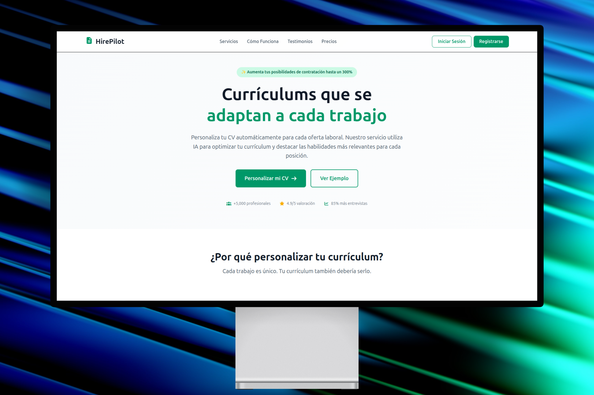
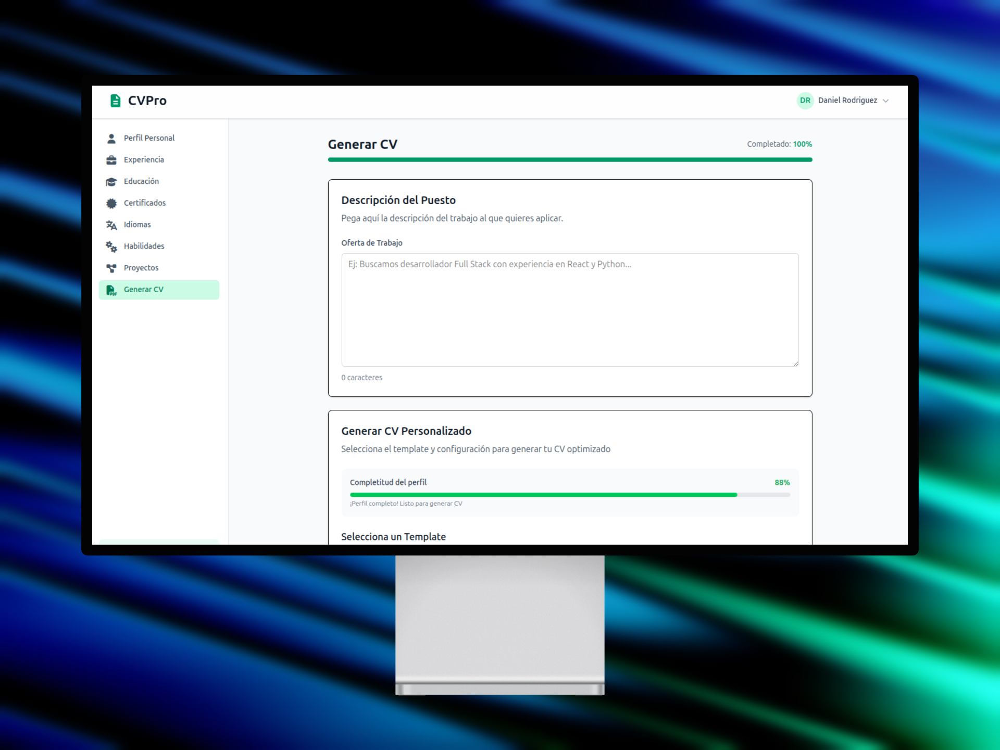
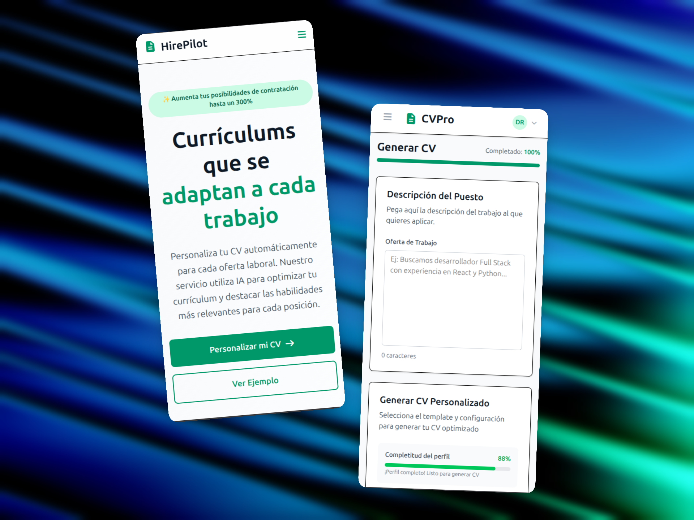

# 🚀 HirePilot

HirePilot es una aplicación web SaaS diseñada para revolucionar la forma en que los candidatos aplican a ofertas de trabajo. Permite a los usuarios generar currículums (CVs) en formato PDF altamente optimizados y adaptados estratégicamente a descripciones de ofertas de empleo (Job Descriptions), garantizando una **política estricta de cero alucinaciones** (cero datos inventados).

## 📖 Tabla de Contenidos
- [Características Principales](#características-principales)
- [Tecnologías Utilizadas](#tecnologías-utilizadas)
- [Vista Previa y Demo](#vista-previa-y-demo)
- [Requisitos Previos](#requisitos-previos)
- [Variables de Entorno (.env)](#variables-de-entorno-env)
- [Instalación y Despliegue Local](#instalación-y-despliegue-local)
- [Estructura del Proyecto](#estructura-del-proyecto)

## ✨ Características Principales
* **Master Data del Perfil:** Almacenamiento exhaustivo de la experiencia laboral, educación, habilidades y proyectos del usuario.
* **Smart Matching:** Análisis semántico (mediante IA) de descripciones de ofertas de trabajo para extraer *keywords* y requisitos clave.
* **Cero Alucinaciones:** Algoritmo que reordena, resalta y reformula la experiencia real del usuario sin inventar absolutamente nada.
* **Generación de PDF:** Renderizado en tiempo real de un CV limpio y profesional listo para descargar.
* **Protección de Datos:** Arquitectura pensada para proteger la PII (Personal Identifiable Information) de los usuarios.

## 💻 Tecnologías Utilizadas

Este proyecto sigue una arquitectura cliente-servidor moderna:

**Frontend:**
* [React 19](https://react.dev/) + [Vite](https://vitejs.dev/)
* [Tailwind CSS v4](https://tailwindcss.com/) para estilos rápidos y responsivos.
* [@react-pdf/renderer](https://react-pdf.org/) para la generación de PDFs en el cliente.
* [Axios](https://axios-http.com/) para el consumo de la API.
* React Router DOM para enrutamiento.

**Backend:**
* [Django 5.2.5](https://www.djangoproject.com/) + [Django REST Framework (DRF)](https://www.django-rest-framework.org/).
* Autenticación basada en JWT (`djangorestframework-simplejwt`).
* Integración con LLMs (OpenAI/Anthropic) para el procesamiento de lenguaje natural.

**Base de Datos e Infraestructura:**
* [PostgreSQL 15](https://www.postgresql.org/)
* [Docker & Docker Compose](https://www.docker.com/) para la contenedorización de la base de datos.

---

## 📸 Vista Previa y Demo


### Dashboard y Landingpage Principal (Tamaño de Ordenador)





### Dashboard y Landingpage Principal (Tamaño de móvil)

<p align="center">
  
</p>

### 🎥 Demo en Video

<p align="center">
  <a href="https://www.youtube.com/watch?v=ry-FJfT5_B4" target="_blank">
    
  </a>
</p>

---

## 🛠️ Requisitos Previos

Asegúrate de tener instalado lo siguiente en tu entorno local:
* [Node.js](https://nodejs.org/) (v18 o superior)
* [Python](https://www.python.org/) (v3.10 o superior)
* [Docker Desktop](https://www.docker.com/products/docker-desktop/) (Para levantar la base de datos)
* Git

---

## 🔐 Variables de Entorno (.env)

Antes de levantar el proyecto, necesitas configurar las variables de entorno. 

**En la carpeta `HirePilot_Backend/`**, crea un archivo `.env` con el siguiente contenido (ajusta los valores según tus credenciales):

```env
# Configuración de Django
SECRET_KEY=tu_secret_key_super_segura
DEBUG=True
ALLOWED_HOSTS=localhost,127.0.0.1

# Configuración de Base de Datos (PostgreSQL en Docker)
DB_ENGINE=django.db.backends.postgresql
DB_NAME=cv_generator_db
DB_USER=postgres
DB_PASSWORD=postgres
DB_HOST=localhost
DB_PORT=5432

# API Keys para IA (Reemplazar con tus claves reales)
OPENAI_API_KEY=tu_openai_api_key
# ANTHROPIC_API_KEY=tu_anthropic_api_key


```

En la carpeta HirePilot_fronted/, crea un archivo .env con:


```env
VITE_API_URL=http://localhost:8000/api
```

## 🚀 Instalación y Despliegue Local

Sigue estos pasos para levantar el entorno de desarrollo en tu máquina.

### 1. Clonar el repositorio

``` bash
git clone https://github.com/danirodriguezz/HirePilot.git
cd HirePilot
```

### 2. Levantar la Base de Datos (PostgreSQL)

Utilizamos Docker Compose para facilitar la configuración de la base de datos.

```bash
docker-compose up -d
```

Esto levantará un contenedor llamado `cv_generator_db_container` con PostgreSQL corriendo en el puerto `5432`.


### 3. Configuración del Backend (Django)

Abre una terminal y dirígete a la carpeta del backend:

```bash
cd HirePilot_Backend
```

Crea y activa un entorno virtual:

``` bash
# En Windows:
python -m venv venv
venv\Scripts\activate

# En macOS/Linux:
python3 -m venv venv
source venv/bin/activate
```

Instala las dependencias:

``` bash
pip install -r requirements.txt
```

Aplica las migraciones a la base de datos:

```bash
python manage.py migrate
```

Crea un superusuario (para acceder al panel de admin de Django):

``` bash
python manage.py createsuperuser
```

Levanta el servidor de desarrollo:

``` bash
python manage.py runserver
```

El backend estará disponible en `http://localhost:8000`.


### 4. Configuración del Frontend (React/Vite)

Abre una nueva pestaña en tu terminal y dirígete a la carpeta del frontend:

```Bash
cd HirePilot_fronted
Instala las dependencias de NPM:
```
```Bash
npm install
Levanta el servidor de desarrollo:
```
```Bash
npm run dev
```

El frontend estará disponible en http://localhost:5173.


## 📁 Estructura del Proyecto
```Plaintext
HirePilot/
├── .github/                 # Archivos específicos de GitHub.
│   └── assets/              # Contiene mockups y capturas de pantalla de la app (móvil y ordenador) usados en la documentación.
│
├── HirePilot_Backend/       # Código fuente del backend (Python / Django).
│   ├── accounts/            # Aplicación para la gestión de usuarios y sus perfiles profesionales.
│   │   ├── migrations/      # Historial de cambios en la estructura de la base de datos.
│   │   ├── tests/           # Pruebas automatizadas (unitarias/integración) para la app accounts.
│   │   ├── models.py        # Define la estructura de datos: User, Education, Experience, Skills, Projects, etc.
│   │   ├── views.py         # Controladores de la API (Endpoints) para gestionar los perfiles.
│   │   └── serializers.py   # Reglas de conversión entre la BBDD y el formato JSON de la API.
│   │
│   ├── cv_generator/        # Aplicación dedicada a la lógica de generación de CVs.
│   │   ├── test/            # Pruebas automatizadas del generador de CVs.
│   │   ├── services.py      # Lógica central del negocio (posiblemente la conexión con IA para adaptar los CVs).
│   │   └── views.py         # Endpoints para recibir peticiones de creación de currículums.
│   │
│   ├── server/              # Configuración global del proyecto Django.
│   │   ├── settings.py      # Configuraciones generales (BBDD, seguridad, apps instaladas, etc.).
│   │   └── urls.py          # Enrutador principal de todas las URLs del backend.
│   │
│   ├── manage.py            # Script principal de Django para ejecutar comandos (servidor, migraciones, etc.).
│   ├── pytest.ini           # Configuración de Pytest para la ejecución de pruebas en el backend.
│   └── requirements.txt     # Listado de dependencias y librerías de Python necesarias.
│
├── HirePilot_fronted/       # Código fuente del frontend (React + Vite).
│   ├── public/              # Archivos estáticos accesibles directamente.
│   │   └── templates/       # Imágenes de muestra de las plantillas del CV (Classic, Creative, Modern).
│   │
│   ├── src/                 # Código fuente principal de la aplicación React.
│   │   ├── api/             # Configuración del cliente HTTP (instancia de Axios para conectar con el backend).
│   │   ├── assets/          # Recursos estáticos empaquetados como fuentes tipográficas (Lato, Merriweather, Roboto) e íconos.
│   │   ├── components/      # Componentes de interfaz reutilizables.
│   │   │   ├── dashboard/   # Secciones específicas del panel del usuario (Educación, Experiencia, etc.).
│   │   │   ├── pdf/         # Componentes encargados de renderizar visualmente el CV en formato PDF.
│   │   │   └── ui/          # Elementos genéricos de interfaz (Modales, Selectores de fecha).
│   │   ├── data/            # Archivos con datos estáticos locales (como testimonios falsos para la landing page).
│   │   ├── hooks/           # Custom hooks de React (ej. utilidades para optimizar búsquedas con debounce).
│   │   ├── pages/           # Vistas completas de la aplicación.
│   │   │   ├── Auth/        # Páginas relacionadas con la autenticación (Login, Registro, Verificación).
│   │   │   └── Dashboard/   # Panel de control principal tras iniciar sesión.
│   │   ├── routes/          # Lógica y definición de las rutas de navegación de la app (React Router).
│   │   └── services/        # Funciones abstractas para hacer llamadas a la API backend separadas por entidad.
│   │
│   ├── index.html           # Punto de entrada HTML de la aplicación frontend.
│   ├── package.json         # Información del proyecto, dependencias de Node.js y comandos de ejecución.
│   └── vite.config.js       # Archivo de configuración para Vite (empaquetador y servidor de desarrollo).
│
├── docker-compose.yml       # Archivo de orquestación de Docker. Permite levantar todo el entorno (Frontend, Backend y BBDD) con un solo comando.
└── README.md                # Archivo principal de documentación del repositorio.
```